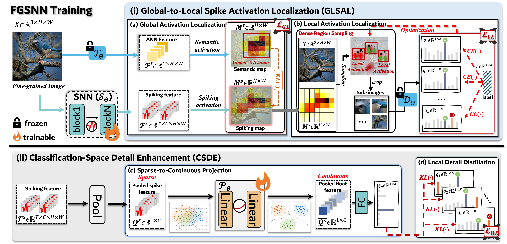

# FGSNN

FGSNN is a spiking neural network framework for fine-grained image classification.

## Architecture



## Training

Main training entry:

- `pl_train_kd_our_snn.py`

Default config:

- `config/cubs200/plt_our_kdtrain_snn_cub.yml`

Run training from the repository root:

```bash
python pl_train_kd_our_snn.py
```

If you want to use another dataset, edit `parse_args()` in `pl_train_kd_our_snn.py` and switch the YAML file under `config/`.

